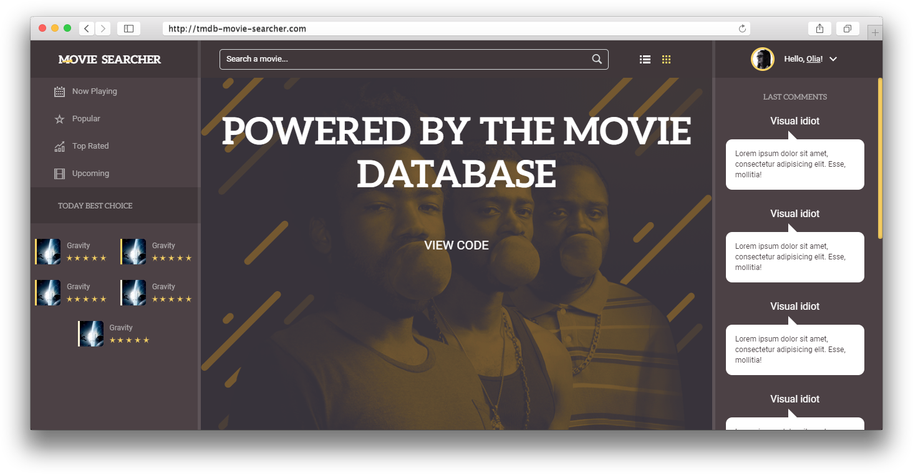

# Вёрстка для проекта «Мувисёрчер»



## Страницы
1. index.html – начальная страница приложения
2. latest.html – страница последних вышедших фильмов. Такая же страница будет для каждого пункта навигационного меню с соотвествующих заголовоком
3. movie.html – страница конкретного фильма
4. favorite.html – страница избранных фильмов
5. 404.html – страница для ошибки 404

## Описание функционала
1. ### Основное
    * При клике на логотип происходит переадресация на главный экран. Поле поиска очищается
    * В мобильной версии есть бургерное меню. При клике на тоглер, должна открываться навигация
    * При вводе названия фильма в инпут, должен происходить запрос к базе с задержкой 0.5 секунд. Реализовать можно как вручную, так и через библиотеку [lodash](https://www.npmjs.com/package/lodash.debounce). Найденные фильмы выводятся в блок ```movies__list```
    * Рядом с инпутом расположены две кнопки, которые позволяют менять отображение карточек с фильмами. Первая кнопка делает отображение в строку, вторая сеткой. При клике по кнопкам, на блок ```movies__list``` добавляется соотвествующий класс: ```movies__list--row``` или ```movies__list--grid```, который и будет менять карточки. На кнопку также навешивается класс ```page-header__button--active```, который окрашивает её в золотой цвет.
    * В блоке пользователя по умолчанию видна кнопка входа, которая позволяет авторизовываться через TMDb. После успешного логина, пользователь может добавлять фильмы в избранное, нажав на соотвествующую кнопку на странице фильма. Незалогиненные пользователи доступа к этой странице не имеют, их следует редиректить на главную.
    * В правую колонку на главной странице должны подгружаться посты из твиттера или какой-либо другой соц.сети, а также название аккаунта и аватарка.
    * В левой колонке на главной страницы помимо навигационного меню, есть блок «Today best choice». В него должны подгружаться 5 самых популярных фильмов 
    * При переходе на страницу, которая не указана в роутах, должна происходить переадресация на страницу ошибки 404
    * При переходе по страницам должна происходить анимация, а также, пока данные не загрузились, должен отображаться прелоадер.
2. ### Страница фильма
    * Сверху страницы должна подгружаться фоновая картинка(```backdrop_path```) со следующими размерами:
      * 300px для мобильных устройств (min-width >= 320px)
      * 780px для планшетов (min-width >= 660px)
      * 1280px для больших мониторов (min-width >= 1900px)
      
      URL для картинок ```https://image.tmdb.org/t/p/w{ширина картинки}/{путь к картинке}```   
    * В центре фоновой картинки должен располагаться подзаголовок фильма (```tagline```) 
    * Должен подгружаться постер фильма (```poster_path```) следующих размеров:
      * 185px для всех устройств (min-width >= 320px)
      * 342px для больших мониторов (min-width >= 1900px)
    * На постере в кружочке располагается рейтинг фильма (```vote_average```). Шкала бывает 3 цветов: зеленая, желтая и красная.
      * Рейтинг больше 8 – зеленая
      * Рейтинг больше 4 – желтая
      * В остальных случаях – красная

      Также шкала должна заполняться по величине рейтинга. Заполнение происходит путем увеличения аттрибута ```stroke-dasharray``` у свг-элемента ```circle```. Максимальный рейтинг 10, т.е. 100%. Берем рейтинг, допустим ```6.5```, и умножаем на ```10```. Получаем значение ```65``` , следовательно значение аттрибута ```stroke-dasharray``` будет равно ```65, 100```
    *  Кнопка «Добавить в избранное» должна быть видна только авторизованным пользователям. При клике на нее выбранный фильм добавляется в список избранного, становится доступным на соответствующей странице. Также появляется попап с сообщением, что фильм успешно добавлен. Попап виден, когда добавляется класс ```message--visible```. Попап должен исчезать через 5 секунд, либо по нажатии на крестик. Для скрытия навешивается класс ```message--hidden```. Если фильм уже в избранном, то при клике на кнопку фильм должен удаляться из списка, сообщение попапа также меняется, поведение остается тем же.
    * После постера фильма, располагается заголовок (```title```)
    * Далее располагаются данные о фильме:
      * Страна создания (```production_countries```)
      * Компания-производитель (```production_companies```)
      * Дата выхода (```release_date```)
      * Список категорий (```genres```)
      * Длительность фильма (```runtime```)
      * Бюджет (```budget```)
      * Доход (```revenue```)
      * Директор (```crew```)
      * Актеры (```cast```)
      * Описание фильма (```overview```)
      * Фотографии фильма (```posters```)
      * Похожие фильмы
      * Рекомендуемые фильмы
      
    * В правой колонке должны выводиться отзывы о фильме (```reviews```)  
2. ### Навигационное меню
    * При клике на ссылки меню, должна открываться новая страница с заголовком, соотвествующим названия ссылки. Также должен происходить запрос к базе и вывод фильмов. Пока данные загружаются, отображается прелоадер. При клике на карточку с фильмом должна открываться страница с подробным описанием.   
      
## Тест lighthouse


Высокие баллы PWA будут при разработке на Vue.js, но, возможно, баллы за performance уменьшатся, в связи с большим количеством JS :)
